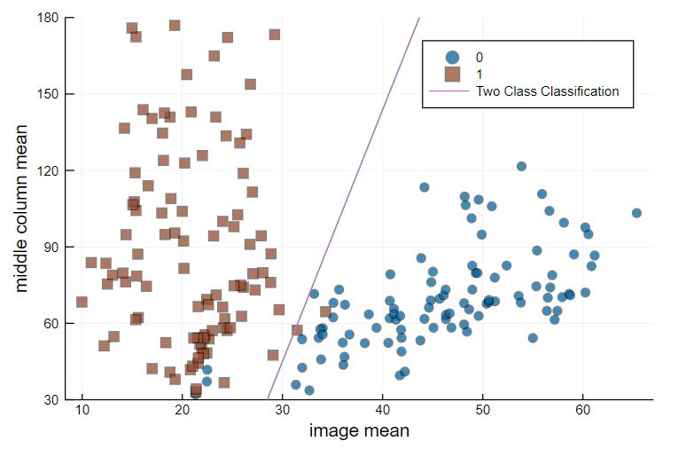
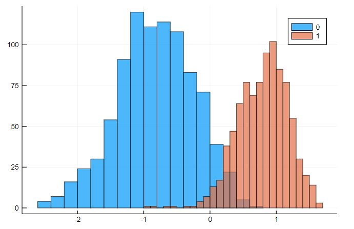

## Matrix-Methods-for-Signal-Processing-and-Machine-Learning

# 1. Hand-written Digit Classification using feature-based linear regression : 
Classifying handwritten digits using linear regression based on "hand crafted" features.

Plot that roughly separates the two classes 

A histogram plot of predicted values to see how well two classes are separated 

